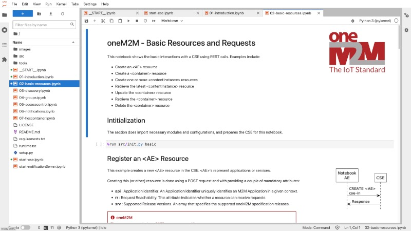

# oneM2M Jupyter Notebooks
This repository contains a number of [Jupyter Notebooks](https://jupyter.org) that give a practical introduction to programmatically interacting with a [oneM2M](http://www.onem2m.org) CSE. The notebooks explain how to access a  CSE, add and update resources, and more.

- [Installation and Configuration](#installation)  
- [Running](#running)
- [Runing on Binder](#binder)  
- [Using the Notebooks](#using)  

## Installation and Configuration

### oneM2M Notebooks and Python Packages

- Download or clone this repository to a local directory.
- Install the necessary Python packages with the following command. You might want to consider to use a virtual environment, such as [pyenv](https://github.com/pyenv/pyenv) to keep your system installation clean.

		pip3 install -r requirements.txt

### Configuration

    <b><i class="fa fa-info-circle" aria-hidden="true"></i>&nbsp; Note</b> 
    Changing the configuration is only necessary when you run another CSE than the one provided with the notebooks.

Please change the configuration in the file [config.py](config.py) according to your setup. Normally, it shouldn't be necessary to change this when using the vanilla configuration from the *Eclipse om2m* installation.

- **cseRN** : The resource name of the CSE.
- **url** : The URL of the CSE we want to connect to in the examples in the notebooks.
- **originator** : Originator ID to access the CSE.
- **notificationPort** : The port for Notification Server.
- **notificationInterface** : The network interface the Notifcation Server binds to. An empty string means "all interfaces".
- **notificationURLBase** : The base URL for the Notification Server.

### oneM2M CSE
The notebooks have been tested with the [ACME oneM2M CSE](https://github.com/ankraft/ACME-oneM2M-CSE). 

These notebooks include the CSE runtime in the directory [tools/ACME](tools/ACME). It needs to be started via the separate notebook [start-cse.ipynb](start-cse.ipynb)

### Notification Server
The Notification server is a separate notebook [start-notificationServer.ipynb](start-notificationServer.ipynb) that implements a simple notification server. The executable script can be found here: [tools/NotificationServer/NotificationServer.py](tools/NotificationServer/NotificationServer.py) .

## Running the Notebooks

The local installation of Jupyter Notebooks can be run with one of the following commands:

- Running with Jupyter Labs (preferred):

		jupyter lab --NotebookApp.token='' __START__.ipynb

- Running with Jupyter Notebook (classic):

		jupyter notebook --NotebookApp.token='' __START__.ipynb

A web page with the start-up notebook opens from which you can select the exercises.

Some browsers are not able to connect to the kernel service. See the following *Troubleshooting* section.

#### Troubleshooting
When you open a notebook in your web browser you might get an error message about a "failed connection". In this case you might try another browser. When starting the Jupyter Notebook server you see a message in the console with a URL that you can paste in a browser, for example: ``http://localhost:8888/?token=<a long token>`` .

If you run the Jupyter Notebook server without authentication token (see the *--NotebookApp.token* option above), just use, for example ``http://localhost:8888`` .

If you enabled the authentication token (which is the default for Jupyter) then you must use this URL including the token, because this authenticates the connection to the local Jupiter Notebook server.

## Working with the Exercises
 

You can run the notebooks in any order. Each notebook has an *init* cell that initializes the notebook and creates the oneM2M resource structure for the exercises. Please execute this code cell when starting with a notebook and before executing any of the other code cells.

You may always execute the first code cell of a notebook again to re-initialize the resource tree.

### CSE & Notification Server Notebooks
- [start-cse.ipynb](start-cse.ipynb)  
This notebook runs a local CSE inside the a notebook. It is required for all the examples in the notebooks.
- [start-notificationServer.ipynb](start-notificationServer.ipynb)  
Notebook for receiving notifications. This must be run before working with the notebook [06-notifications-server.ipynb](06-notifications-server.ipynb).

### oneM2M Notebooks & Exercises
- [01-introduction.ipynb](01-introduction.ipynb)  
An introduction that demonstrates how to retrieve the root &lt;CSEBase> resource.
- [02-basic-resources.ipynb](02-basic-resources.ipynb)  
This notebook shows your how to create and work with the basic oneM2M resources: &lt;AE>, &lt;Container> and &lt;ContentInstance>.
- [03-discovery.ipynb](03-discovery.ipynb)  
How do you search for resources in a CSE?.
- [04-groups.ipynb](04-groups.ipynb)  
Group resources together and send requests to a group instead of each single resource.
- [05-accesscontrol.ipynb](05-accesscontrol.ipynb)  
Control access to resources with Access Control Policies.
- [06-notifications.ipynb](06-notifications.ipynb)  
Subscribe to changes of resources and receive notifications.
- [07-flexcontainer.ipynb](07-flexcontainer.ipynb)  
What are &lt;FlexContainer> resources and how to use them?

## Running online with Binder
The oneM2M notebooks can be run online with [binder](https://mybinder.org):  
[https://mybinder.org/v2/gh/ankraft/onem2m-jupyter-notebooks/master?urlpath=lab/tree/\_\_START__.ipynb](https://mybinder.org/v2/gh/ankraft/onem2m-jupyter-notebooks/master?urlpath=lab/tree/__START__.ipynb)

## License

These Notebooks are available under the BSD 3-Clause License.

